**Connect Hub and Spoke Networks with VNet Peering**

1> Having Two Virtual network Hub Vnet and Spoke Vnet
2> Hub Vnet is having App Server and Spoke Vnet is having Jump Server.
3> Remote access to Jump server and from jump server perform RDP to app server privately using Vnet Peering.

 Diagram
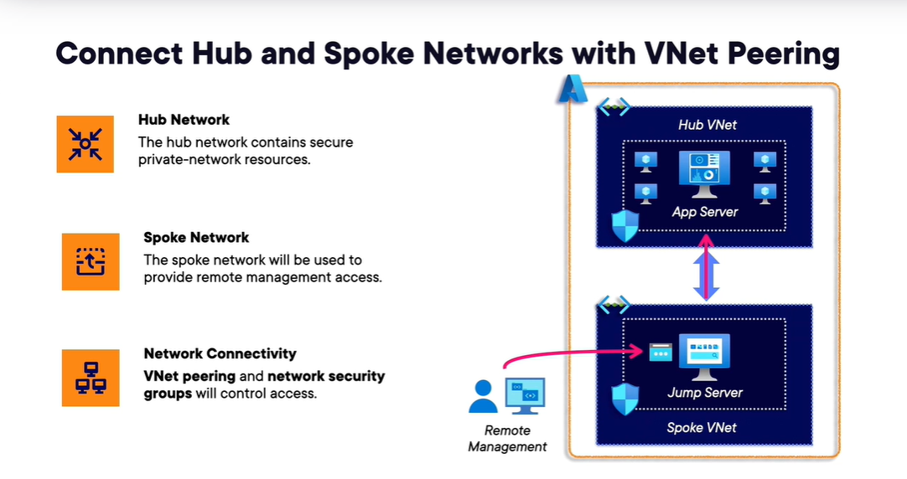

Create and associate public IP to Jump server Nic to get remote access.

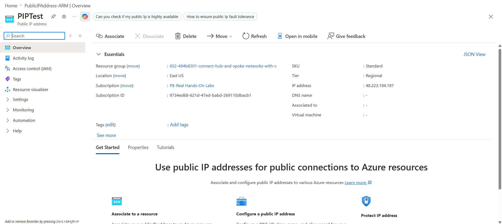

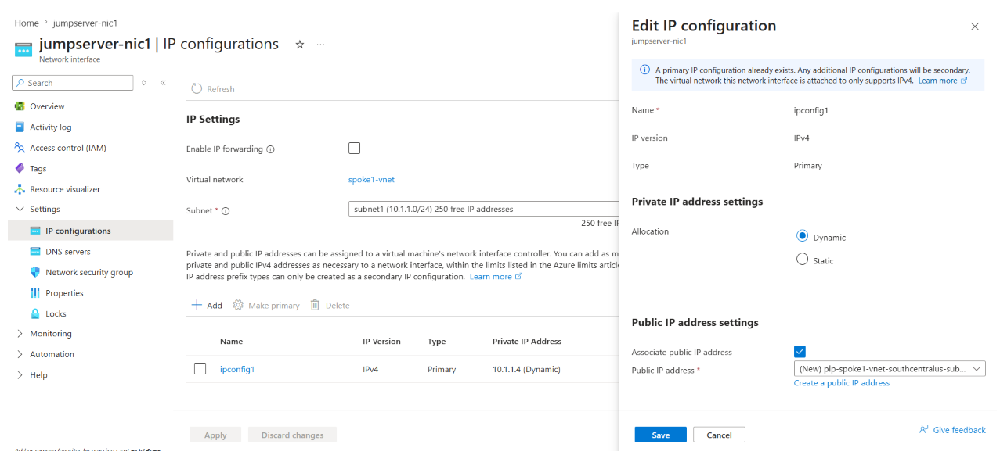

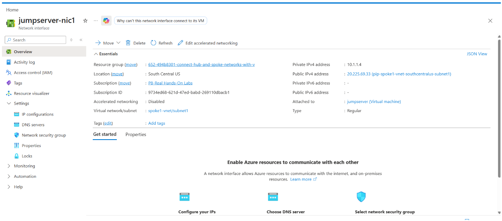

Create Peering between hub and spoke Vnets

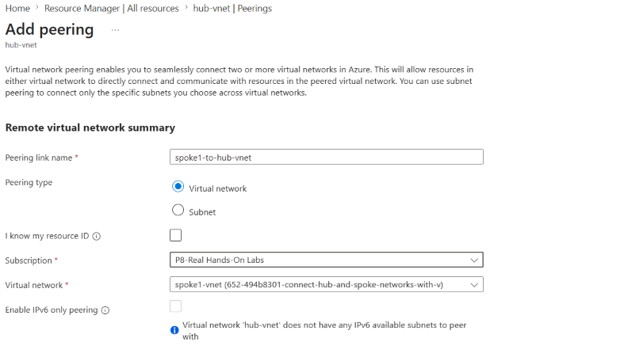

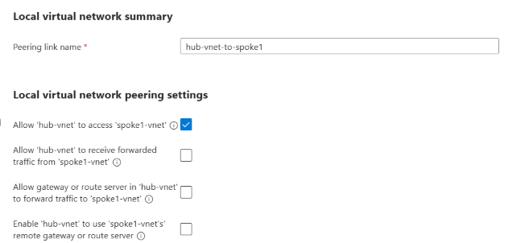

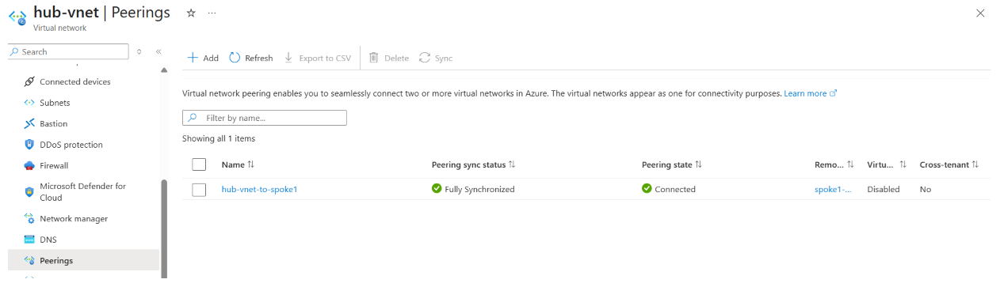

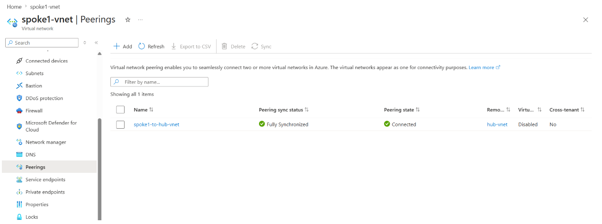

Added Inbound NSG rule on SpokeVnet for RDP on Jump server.

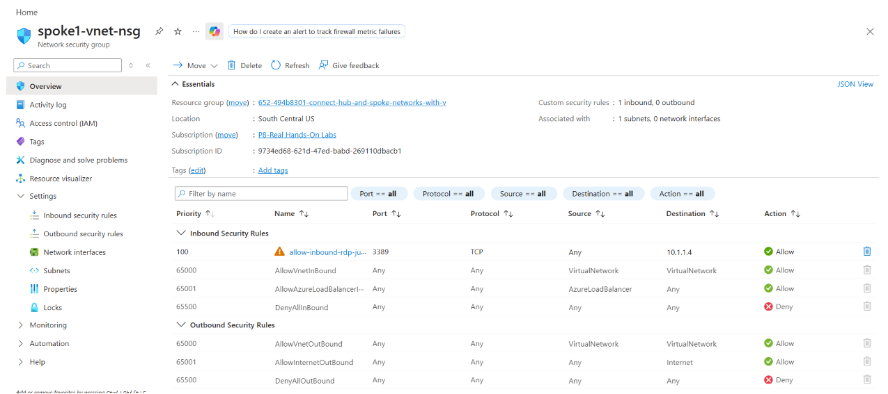

Add Inbound NSG rule on HUB-Vnet NSG to connect Jump server to App server.

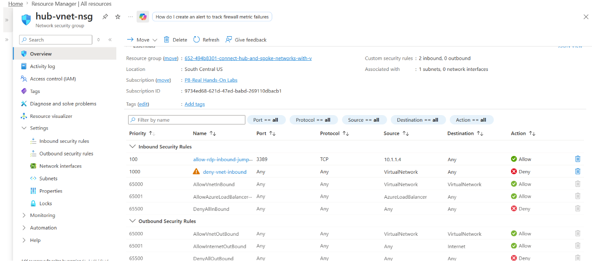

Logged in to the Jump server and then do RDP to App server.

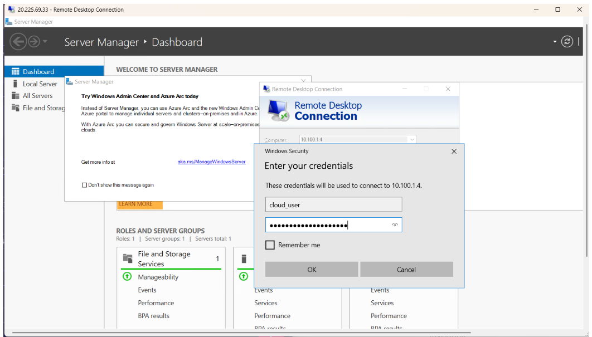

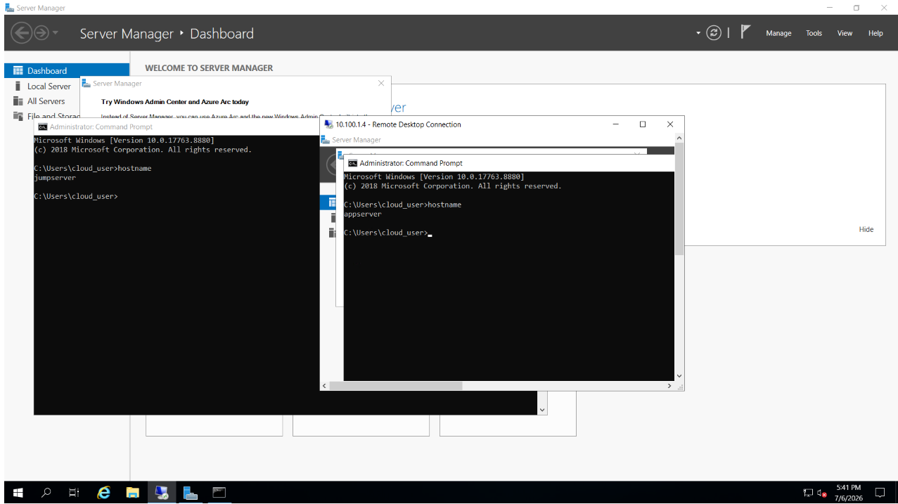
